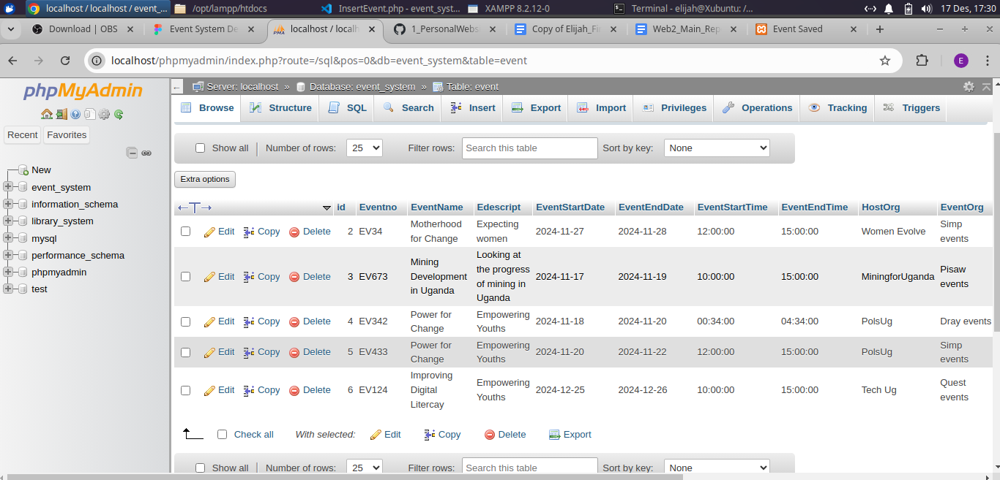

# Event Management System

An Event System Management (ESM) for hotels integrates event management, staff allocation, and room booking functionalities to provide a unified solution for managing hotel events. The system ensures efficient event planning, resource optimization, and client satisfaction.

## Table of contents

- [Project Overview](#project-overview)
  - [Title](#title)
  - [Objective](#objective)
  - [Applicability](#applicability)
  - [Primary Users](#primary-users)
  - [Situations of System Usage](#situations-of-system-usage)
- [Technical Specifications](#technical-specifications)
  - [Hardware Components Used](#hardware-components-used)
  - [Software Components Used](#software-components-used)
- [Architecture Design](#architecture-design)
  - [Frontend (Presentation Layer)](#frontend-presentation-layer)
  - [Backend (Logic Layer)](#backend-logic-layer)
  - [Database (Data Layer)](#database-data-layer)
- [System Implementation](#system-implementation)
  - [Frontend Implementation](#frontend-implementation)
  - [Backend Implementation](#backend-implementation)
  - [Database Integration](#database-integration)
- [Testing and Results](#testing-and-results)
  - [System Testing](#system-testing)
  - [Test Cases and Outputs](#test-cases-and-outputs)
  - [Performance Metrics](#performance-metrics)
- [Conclusion and Recommendations](#conclusion-and-recommendations)
  - [Summary of the System](#summary-of-the-system)
  - [Recommendations](#recommendations)
- [References and Citations](#references-and-citations)

## Project Overview

### Title

An Event System Management for Hotels.

### Objective

This project aims to design and develop an Event System Management application for hotels. Key objectives include:

- Facilitating CRUD operations on staff, events, rooms, and attendees.
- Establishing and managing database relationships.
- Enabling event scheduling and resource allocation.

### Applicability:

The ESM is applicable to hotels that host events of varying scales. It helps:

• Simplify complex event planning processes.

• Enhance guest satisfaction by delivering well-organized events.

• Improve revenue by optimizing venue and resource utilization.

### Primary Users:

**Event Coordinators:** Oversee the entire event planning and ensure smooth execution.

**Hotel Staff:** Such as waiters, system administrators and managers who need clear schedules and event and room allocations.

**Clients:** Including individuals or corporate representatives who plan and book events through the hotel.

### Situations of System Usage:

**Corporate Meetings:** A business contacts the hotel to organize a large-scale conference. The system helps with scheduling, and guest list management.

**Annual Events and Celebrations:** Hotels hosting recurring events can rely on the system for consistent service delivery and customer retention.

## Technical Specifications

### Hardware Components Used

| Component | Model   | Purpose                  |
| --------- | ------- | ------------------------ |
| Router    | Zuku    | Internet Provision       |
| Laptop    | HP      | Coding                   |
| Phone     | Samsung | Viewing code and designs |
| Keyboard  | HP      | Coding and Design        |
| Mouse     | HP      | Coding and Design        |

### Software Components Used

| Component | Version | Purpose                   |
| --------- | ------- | ------------------------- |
| VSCode    | 4.8     | Development Environment   |
| Lamp      |         | Web server                |
| Git       |         | Version history           |
| Github    |         | Storing and Managing Code |
| Figma     |         | User-interface Design     |

## Architecture Design

The Event System Management (ESM) for hotels is typically built using a three-tier architecture consisting of the Frontend (Presentation Layer), Backend (Logic Layer), and Database (Data Layer). Each tier has distinct responsibilities, and purposes which includes modularity, scalability, and maintainability.

### Frontend (Presentation Layer)

The Frontend is the user interface (UI) that hotel staff interact with. It is designed to provide a seamless user experience while communicating with the backend.

**<ins>Key Components:</ins>**

• **Web Interface:** Built using HTML and CSS to create responsive, interactive designs.

• **Features:**

◦ Booking forms for events.

◦ Event and room schedules.

◦ Staff addition

◦ Attendee list

◦ Interactive dashboards for staff.

### Backend (Logic Layer)

The Backend handles the business logic, processes requests from the frontend, and interacts with the database. It acts as the brain of the system, ensuring smooth operations.

**<ins>Key Components:</ins>**

• **Application Server:** Built with backend languages like PHP

• **Features:**

◦ Event management logic.

◦ Resource allocation algorithms.

### Database (Data Layer)

The Database stores and manages all data related to the system. This includes user information and event details.

**<ins>Key Components:</ins>**

• **Database Management System (DBMS):**

◦ Relational Databases: MySQL, InnoDB for structured data (e.g., user accounts, bookings).

• **Features:**

◦ Storage of event-related details (e.g., venue, staff-assigned, attendees).

◦ Logging and auditing of system actions for traceability.

◦ Backup and disaster recovery mechanisms.

**Data Flow in the Architecture**

1. **User Interaction (Frontend):** A staff uses the web to book an event.
2. **Request Processing (Backend):**

   ◦ The request is sent via a connection request to the backend server from PHP.

   ◦ The backend validates the request and checks for conflicts (e.g., double booking of a venue).

   ◦ Necessary business logic is executed.

3. **Data Storage/Retrieval (Database):**

   ◦ The backend retrieves or stores data in the database (e.g., storing the booking details or fetching availability).

## System Implementation

### Frontend Implementation

_Input field_ - where you input the details of the event

_Submit button_ - where you submit the details you have entered about the event

_View Event button_ - where you view event details from the database

### Backend Implementation

This is a code snippet of how the event details are inputted into the database after you click the submit button for event details.

    InsertEvent.php:

    <?php
    // Step 1: Get Data from the Form [Frontend]
    if (isset($_POST['Save']))
    {
        $Evno = $_POST['Eventno'];
        $EVN = $_POST['EventName'];
        $EVD = $_POST['Edescript'];
        $ESD = $_POST['EventStartDate'];
        $EED = $_POST['EventEndDate'];
        $EST = $_POST['EventStartTime'];
        $EET = $_POST['EventEndTime'];
        $Hog = $_POST['HostOrg'];
        $Eog = $_POST['EventOrg'];
        $Orgemail = $_POST['Organizeremail'];
        $Orgphoneno = $_POST['Organizerphoneno'];
        $Attsize = $_POST['Attsize'];
        $AC = $_POST['AdditionalComments'];
        $CreatedBy = $_POST['Created_by'];

        //echo $Evno. " ". $EVN;

        // Step 2 : Connect to the database

        include("configurations/connect.php");

        // Step 3 : Write the SQL Command

        $stmt = $conn->prepare("INSERT INTO event (Eventno, EventName, Edescript, EventStartDate, EventEndDate, EventStartTime, EventEndTime, HostOrg, EventOrg, Organizeremail, Organizerphoneno, Attsize, AdditionalComments, Created_by)

        VALUES (:e, :n, :d, :sd, :ed, :st, :et, :ho, :eo, :oe, :op, :az, :ac, :created_by)");
        $stmt->bindParam(':e', $Evno);
        $stmt->bindParam(':n', $EVN);
        $stmt->bindParam(':d', $EVD);
        $stmt->bindParam(':sd', $ESD);
        $stmt->bindParam(':ed', $EED);
        $stmt->bindParam(':st', $EST);
        $stmt->bindParam(':et', $EET);
        $stmt->bindParam(':ho', $Hog);
        $stmt->bindParam(':eo', $Eog);
        $stmt->bindParam(':oe', $Orgemail);
        $stmt->bindParam(':op', $Orgphoneno);
        $stmt->bindParam(':az', $Attsize);
        $stmt->bindParam(':ac', $AC);
        $stmt->bindParam(':created_by', $CreatedBy);

        // Step 4 : Execute the SQL Command

        if($stmt->execute())
        {
            echo "Event Details Successfully Saved";
        }
    }
    ?>

### Database Integration

Inserting of event details into the database:

    <?php
    // Step 1: Get Data from the Form [Frontend]
    if (isset($_POST['Save']))
    {
        $Evno = $_POST['Eventno'];
        $EVN = $_POST['EventName'];
        $EVD = $_POST['Edescript'];
        $ESD = $_POST['EventStartDate'];
        $EED = $_POST['EventEndDate'];
        $EST = $_POST['EventStartTime'];
        $EET = $_POST['EventEndTime'];
        $Hog = $_POST['HostOrg'];
        $Eog = $_POST['EventOrg'];
        $Orgemail = $_POST['Organizeremail'];
        $Orgphoneno = $_POST['Organizerphoneno'];
        $Attsize = $_POST['Attsize'];
        $AC = $_POST['AdditionalComments'];
        $CreatedBy = $_POST['Created_by'];

        //echo $Evno. " ". $EVN;

        // Step 2 : Connect to the database

        include("configurations/connect.php");

        // Step 3 : Write the SQL Command

        $stmt = $conn->prepare("INSERT INTO event (Eventno, EventName, Edescript, EventStartDate, EventEndDate, EventStartTime, EventEndTime, HostOrg, EventOrg, Organizeremail, Organizerphoneno, Attsize, AdditionalComments, Created_by)

        VALUES (:e, :n, :d, :sd, :ed, :st, :et, :ho, :eo, :oe, :op, :az, :ac, :created_by)");
        $stmt->bindParam(':e', $Evno);
        $stmt->bindParam(':n', $EVN);
        $stmt->bindParam(':d', $EVD);
        $stmt->bindParam(':sd', $ESD);
        $stmt->bindParam(':ed', $EED);
        $stmt->bindParam(':st', $EST);
        $stmt->bindParam(':et', $EET);
        $stmt->bindParam(':ho', $Hog);
        $stmt->bindParam(':eo', $Eog);
        $stmt->bindParam(':oe', $Orgemail);
        $stmt->bindParam(':op', $Orgphoneno);
        $stmt->bindParam(':az', $Attsize);
        $stmt->bindParam(':ac', $AC);
        $stmt->bindParam(':created_by', $CreatedBy);

        // Step 4 : Execute the SQL Command

        if($stmt->execute())
        {
            echo "Event Details Successfully Saved";
        }
    }
    ?>

**Connect page - connecting to the database:**

    <?php
        $servername = "127.0.0.1";
        $username = "root";
        $password = "";
        $db = "event_system";

        try {
        $conn = new PDO("mysql:host=$servername;dbname=$db", $username, $password);
        // set the PDO error mode to exception
        $conn->setAttribute(PDO::ATTR_ERRMODE, PDO::ERRMODE_EXCEPTION);
        //echo "Connected successfully";
        } catch(PDOException $e) {
        echo "Connection failed: " . $e->getMessage();
        }
    ?>

**Evidence of database integration**

## Testing and Results

### System Testing

Records already entered

### Test Cases and Outputs

**Inputting Event Details:**

**Expected Output:**

**Actual Result:**

### Performance Metrics:

- **Response Time:** Ideally under 2 seconds for user requests such as booking events or checking schedules.
- **Reliability:** Maintain at least 99.9% uptime with a failure rate below 0.01%, ensuring consistent system availability.
- **Data Accuracy:** Ensure real-time synchronization of changes across the system (target: under 1 second).
- **Security:** Implement robust measures such as SQL injection prevention, encrypted data transmission, and role-based access control to protect sensitive event and user information.

## Conclusion and Recommendations

### Summary of the System

This project enables users to efficiently perform CRUD operations on staff, events, rooms, and attendee details. It streamlines event scheduling, ensuring seamless management and coordination.

### Recommendations

To enhance the system, the following improvements are suggested:

- **UI Design:** Upgrade the user interface with modern frameworks like Bootstrap or Tailwind CSS for a more intuitive and visually appealing experience.
- **Technology Integration:** Leverage APIs and advanced web frameworks such as React or Next.js to improve functionality and responsiveness.
- **Future Development:** Expand the system by creating a mobile application version to provide users with convenient access on the go.
- **Advanced Features:** Incorporate AI-driven recommendations for resource allocation and IoT integrations for real-time monitoring of rooms and resources.

## References and Citations

W3Schools (2024). PHP Connect to MySQL. W3Schools.[(https://www.w3schools.com/php/php_mysql_connect.asp)]

_W3Schools (2024). PHP MySQL Insert Data. W3Schools._[(https://www.w3schools.com/php/php_mysql_insert.asp)]

_MDN (2024). Sending form data. Mozilla Corporation_[(https://developer.mozilla.org/en-US/docs/Learn_web_development/Extensions/Forms/Sending_and_retrieving_form_data)]
